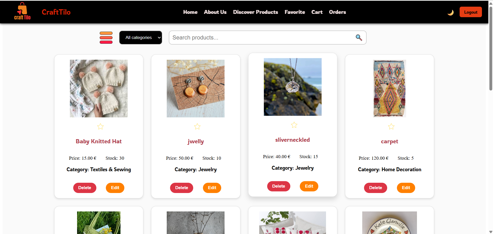

# Handmade E-Commerce Platform

This project is a full-stack e-commerce website for handmade products, built with Angular for the frontend and Spring Boot for the backend. It allows users to explore, search, and purchase unique handmade items, while vendors can manage their product listings.

---

## Frontend Features (Angular)

- User authentication with login and registration
- Role-based access control:
  - **User**: browse products, view details, add to cart and favorites, place orders
  - **Vendor**: add, edit, and delete products (restricted access)
- Product browsing by category with search bar
- Detailed product pages
- Shopping cart management
- Favorite products for future reference
- Order creation with user delivery details
- Email confirmation sent upon order with PDF summary

---

## Backend Features (Spring Boot)

- Secure REST API with Spring Security
- User roles and authorization
- Product management (CRUD) for vendors
- Cart and favorites APIs for users
- Order processing and validation
- Email notification with PDF invoice generation using iText PDF
- MySQL database for persistence

---

## Database

- MySQL is used as the relational database management system
- Configured via `application.properties` in the backend project
- Stores users, roles, products, orders, favorites, and cart information

---

## Screenshots

### Home Page (1/4)


### Home Page (2/4)


### Home Page (3/4)


### Home Page (4/4)


### Login Page


### Discover Products Page


### Favorites Page


### Cart Page


### Order Summary Page


---

## Tech Stack

- Frontend: Angular, Reactive Forms, HTTP Client
- Backend: Spring Boot, Spring Security, Spring Data JPA, Java Mail, iText PDF
- Database: MySQL

---

## Setup Instructions

### Frontend

1. Clone the frontend repository:
   ```bash
   git clone https://github.com/YOUR_USERNAME/e-commerce-angular.git](https://github.com/AmalDhouib/e-commerce-springboot.git
   cd e-commerce-angular
